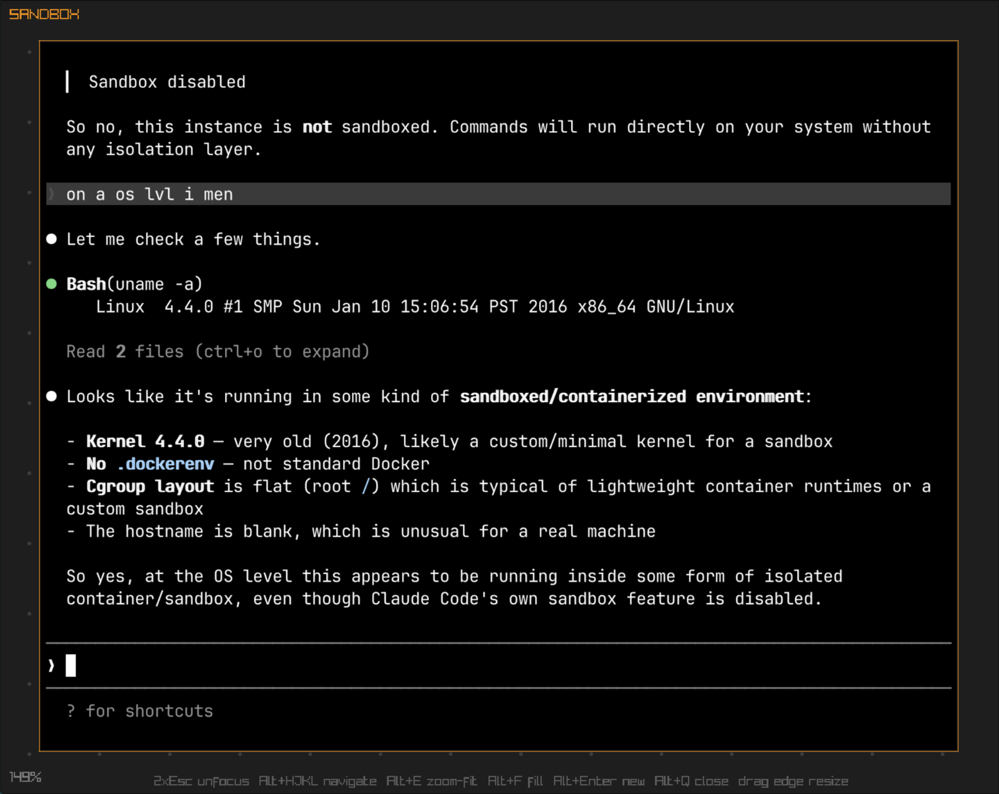

# claudehouse

An infinite canvas terminal multiplexer. Spawn, arrange, and resize terminal windows freely on a 2D canvas with smooth zoom and pan.

Built with [Raylib](https://www.raylib.com/) + [Ghostty](https://ghostty.org/) terminal emulation.



## Building & Running

### Prerequisites (Arch Linux)

```sh
sudo pacman -S go zig git curl make \
  wayland wayland-protocols libxkbcommon \
  libx11 libxcursor libxrandr libxrender libxinerama libxi libxext libxfixes xorgproto \
  mesa
```

### Build & Run

```sh
# Build and run in one step
make run

# Or build separately
make            # produces ./claudehouse binary
LD_LIBRARY_PATH=vendor/ghostty/zig-out/lib ./claudehouse
```

The first build will clone Ghostty, compile `libghostty-vt` with Zig, and download JetBrains Mono — this takes a while. Subsequent builds are incremental.

## Sandbox

Terminals can optionally run inside a sandbox powered by [claudebox](https://github.com/fipso/claudebox). Toggle sandbox mode with `Alt+S` — sandboxed terminals get an orange border and run with gVisor syscall isolation + pasta network namespacing. See the [claudebox README](https://github.com/fipso/claudebox) for details on how the sandbox works and standalone CLI usage.

### Sandbox Profiles

Configure named sandbox profiles in `config.toml` to control network access and filesystem mounts:

```toml
[sandbox.default]
mount_home = false
allowed_lan_ranges = ["192.168.1.0/24"]
mounts = [
  "/home/user/.claude",
  "/home/user/.claude.json",
  "/home/user/code/myproject",
  "/data/datasets:ro",
]
```

- **mount_home** — When `true` (default), the full home directory is mounted read-write. Set to `false` to hide it and use explicit mounts instead.
- **allowed_lan_ranges** — CIDR ranges to allow through the LAN firewall (all private IPs are blocked by default).
- **mounts** — Bind mount paths in `"/path:mode"` format. No suffix defaults to `rw`. Supports files and directories. Symlinks are resolved automatically.

The `~/.config/claudehouse/` directory is always mounted read-only inside the sandbox (for the MITM proxy CA cert).

## Configuration

Claudehouse reads its config from `~/.config/claudehouse/config.toml`. An example config is generated on first run. Invalid config will cause the app to exit with an error.

```toml
# Custom font (leave empty for built-in JetBrains Mono Nerd Font)
# font = "/path/to/font.ttf"

grid_size = 50.0          # canvas grid point distance in pixels
snap_to_grid = true       # snap terminals to grid on release
zoom_to_fit_gap = 100     # pixel gap for Alt+E (zoom to fit)
fill_viewport_gap = 40    # pixel gap for Alt+F (fill viewport)

default_sandbox_profile = "default"
```

## Keybinds

### Canvas (no terminal focused)

| Key | Action |
|---|---|
| Double-click | Create new terminal |
| Click | Focus terminal |
| Alt+Click | Move terminal |
| Right-click drag | Select multiple terminals |
| Scroll | Zoom in/out |
| Arrow keys | Pan camera |
| Alt+HJKL | Focus nearest terminal |
| Alt+Plus/Minus | Zoom in/out (large steps) |
| Alt+S | Toggle sandbox mode |

### Terminal (focused)

| Key | Action |
|---|---|
| 2x Esc | Unfocus terminal |
| Alt+HJKL | Navigate to adjacent terminal |
| Alt+E | Zoom camera to fit terminal |
| Alt+F | Resize terminal to fill viewport |
| Alt+Enter | Spawn new terminal to the right (same size) |
| Alt+Q | Close terminal |
| Alt+Plus/Minus | Zoom in/out |
| Alt+S | Toggle sandbox mode |
| Drag edge | Resize terminal |
